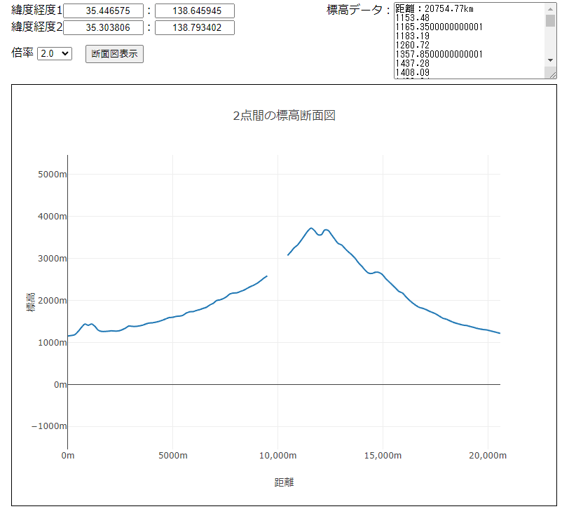
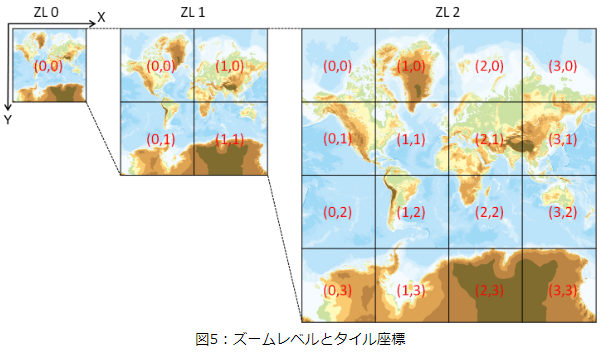

# 2つの地点間の標高の求め方と地形の断面図

## はじめに

国土地理院の[標高タイル](https://maps.gsi.go.jp/development/ichiran.html#dem)を使い、2点間の標高を配列で取得します。

最も高精度な`DEM5A`を利用します。(一部データがない場所がありますが、低精度のタイルへのフォールバックはしていません)

[動作確認ページ](https://murasuke.github.io/cross-section-view/)


* 利用サンプル




## 国土地理院タイルの特徴

* タイルはメルカトル図法
* 地図画像は縦横256pixcelの正方形
* ズームレベル0は全世界を1枚(256×256)で表示する
  * 緯度は約85度まで(発散してしまうので、256pxに収まる範囲まで)
  * 左上を原点とする座標系(西経180度北緯85度)
  * 緯度0経度0が画像の中心になる
* レベル1はそれを縦横2分割(2×2=4枚)、レベル2はさらに2分割(4×4=16枚)
  * レベルが上がるごとに詳細な地図に分割されていく(上限は提供される地図毎に異なる)


* 参考画像

  


## タイルのURL
```
  https://cyberjapandata.gsi.go.jp/xyz/{t}/{z}/{x}/{y}.{ext}
  {t}：データID　dem5a_pngを利用
  {x}：左上を原点にしたタイルの位置(X)
  {y}：左上を原点にしたタイルの位置(Y)
  {z}：ズームレベル
  {ext}：拡張子
    ex. zoomlevel:6 左上からx方向に57枚目、y方向に23枚目のタイルを取得
    https://cyberjapandata.gsi.go.jp/xyz/std/6/57/23.png
```

## 任意の2点間の標高を配列で取得する手順

1. 経度緯度から座標へ変換 ⇒ 座標から標高画像タイルとタイル内の位置を算出
2. タイルの位置を元にタイル画像を読み込みCanvasへ描画(pixcelの色情報を取得するため)
3. 画像の特定ピクセルの色情報から、標高へ変換する関数を作成
4. 2点間を線形補正して座標の配列を求める
5. 2点間座標から標高を算出する


### 1. 経緯から座標へ変換 ⇒ 座標から標高画像タイルとタイル内の位置を算出

* 経度から座標(タイルとタイル内pixcel)を計算

```javascript

/**
 * 経度から座標(タイルとタイル内pixcel)を計算
 * @param {number} lng 経度
 * @param {number} z zoomlevel
 * @returns
 */
export const calcCoordX = (lng, z) => {
  // ラジアンに変換
  const lng_rad = (Math.PI / 180) * lng;

  // zoomレベル0の場合、256pxで360度(2PIラジアン)
  //  ⇒ ラジアンあたりpxを計算
  const R = 256 / (2 * Math.PI);

  // グリニッジ子午線を原点とした位置(x) (-128～128)
  let worldCoordX = R * lng_rad;

  // 左端を原点にするために180度分を加算する(0～256)
  worldCoordX = worldCoordX + R * (Math.PI / 180) * 180;

  // 1周256px換算で計算した値にzoomをかけて、zoomで換算した画像の位置を計算
  //  ⇒ https://maps.gsi.go.jp/development/siyou.html#siyou-zm
  const pixelCoordX = worldCoordX * Math.pow(2, z);

  // 1つの画像が256pxなので、256で割って左端からの画像の枚数(タイルの位置)を求める
  // (0オリジンなので切り捨て)
  const tileCoordX = Math.floor(pixelCoordX / 256);

  // 左側のタイル幅合計を引いて、表示タイル内のpx位置を算出する
  const imageCoordX = Math.floor(pixelCoordX - tileCoordX * 256);

  // 計算した値を返す
  return {
    worldCoordX,
    pixelCoordX,
    tileCoordX,
    imageCoordX,
  };
};
```

* 緯度から座標(タイルとタイル内pixcel)を計算

```javascript

/**
 * 緯度から座標(タイルとタイル内pixcel)を計算
 * メルカトル図法で緯度から位置を算出する式 (https://qiita.com/Seo-4d696b75/items/aa6adfbfba404fcd65aa)
 *  R ln(tan(π/4 + ϕ/2))
 *    R: 半径
 *    ϕ: 緯度(ラジアン)
 * @param {number} lat 緯度
 * @param {number} z zoomlevel
 * @returns
 */
export const calcCoordY = (lat, z) => {
  // ラジアン
  const lat_rad = (Math.PI / 180) * lat;

  // zoomレベル0の場合、256pxで360度(2PIラジアン)
  //  ⇒ ラジアンあたりpxを計算
  const R = 256 / (2 * Math.PI);

  // メルカトル図法で緯度から位置を算出
  let worldCoordY = R * Math.log(Math.tan(Math.PI / 4 + lat_rad / 2));

  // 赤道からの位置(北緯)で計算しているので、左上を原点とするため軸を逆転＋北極側を原点に換算
  worldCoordY = -1 * worldCoordY + 128;

  // 256px換算で計算した値にzoomをかけて、zoomで換算した画像の位置を計算
  const pixelCoordY = worldCoordY * Math.pow(2, z);

  // 1つの画像が256pxなので、256で割って左端からの画像の枚数(位置)を求める
  // 0オリジンなので切り捨て
  const tileCoordY = Math.floor(pixelCoordY / 256);

  // 上側のタイル幅合計を引いて、表示タイル内のpx位置を算出する
  const imageCoordY = Math.floor(pixelCoordY - tileCoordY * 256);

  // 計算した値を返す
  return {
    worldCoordY,
    pixelCoordY,
    tileCoordY,
    imageCoordY,
  };
};
```

* 緯度、経度をもとに各種座標を返すユーティリティー

```javascript

/**
 * 指定位置に該当するタイル位置と、該当タイル内の位置を返す
 * @param {number} lat 緯度
 * @param {number} lng 経度
 * @param {number} z zoomlevel
 * @returns
 */
export const calcTileInfo = (lat, lng, z) => {
  // (x, y): 指定位置に該当するタイル位置
  // (pX, pY): 該当タイル内の位置
  const coordX = calcCoordX(lng, z);
  const coordY = calcCoordY(lat, z);
  return {
    wX: coordX.worldCoordX,
    wY: coordY.worldCoordY,
    pX: coordX.pixelCoordX,
    pY: coordY.pixelCoordY,
    tX: coordX.tileCoordX,
    tY: coordY.tileCoordY,
    iX: coordX.imageCoordX,
    iY: coordY.imageCoordY,
    z,
  };
};
```


### 2. タイルの位置を元にタイル画像を読み込みCanvasへ描画(pixcelの色情報を取得するため)

```javascript

/**
 * 読み込んだタイルをCanvasに描画して返す
 *　・色情報を取得できるようにするため、Canvasへ描画する
 * @param {number} x タイルのx枚目
 * @param {number} y タイルのy枚目
 * @param {number} z zoomlevel
 * @param { {dataType: string, ext?: string} } option タイルの種類
 * @returns {Promise<CanvasRenderingContext2D>} CanvasのContext
 */
export const loadTile = async (x, y, z, option) => {
  const { dataType, ext } = option;

  const url = `https://cyberjapandata.gsi.go.jp/xyz/${dataType}/${z}/${x}/${y}.${
    ext ?? 'png'
  }`;

  // Image(HTMLImageElement)を利用して画像を取得
  const img = new Image();
  img.setAttribute('crossorigin', 'anonymous');
  img.src = url;

  // 縦横256pixcelのCanvasを生成する
  const canvas = document.createElement('canvas');
  [canvas.width, canvas.height] = [256, 256];
  const ctx = canvas.getContext('2d', { willReadFrequently: true });

  // onloadは非同期で発生するため、Promise()でラップして返す
  return new Promise((resolve, reject) => {
    img.onload = () => {
      // 読み込んだ座標をCanvasに描画して返す
      ctx.drawImage(img, 0, 0);

      resolve(ctx);
    };
  });
};
```


### 3. 画像の特定ピクセルの色情報から、標高へ変換する関数を作成
```javascript
/**
 * 標高タイルの色情報から標高を算出
 * @param {number} lat
 * @param {number} lng
 * @param {CanvasRenderingContext2D}
 * @returns {Promise<number>}
 */
export const elevationFromTile = (pX, pY, ctx) => {
  const z = 15;

  const { data } = ctx.getImageData(0, 0, 256, 256);
  // 1pxあたり4Byte(RGBA)
  const idx = pY * 256 * 4 + pX * 4;
  const r = data[idx + 0];
  const g = data[idx + 1];
  const b = data[idx + 2];

  // 標高に換算
  let h = undefined;
  const resolution = 0.01; // 分解能

  // 定義に従い計算
  // x = 2^16R + 2^8G + B
  // x < 2^23の場合　h = xu
  // x = 2^23の場合　h = NA
  // x > 2^23の場合　h = (x-2^24)u
  // uは標高分解能（0.01m）
  const x = r * 2 ** 16 + g * 2 ** 8 + b;
  if (x < 2 ** 23) {
    h = x * resolution;
  } else if (x == 2 ** 23) {
    h = undefined;
  } else if (x > 2 ** 23) {
    h = x - 2 ** 24 * resolution;
  }

  return h;
};
```

### 4. 2点間を線形補正して座標の配列を求める

```javascript
/**
 * 2点間の線形補完
 * 垂直でも計算しやすいので、中間の点を求めて再帰で分割
 * ・(2^再帰の深さ + 1)に分割する
 * @param {number} p1x
 * @param {number} p1y
 * @param {number} p2x
 * @param {number} p2y
 * @param {number} maxDepth = 7
 * @param {number} depth 現在の再帰の深さ
 * @returns
 */
const lerp = (p1x, p1y, p2x, p2y, maxDepth = 7, depth = 0) => {
  if (depth >= maxDepth) {
    return [p1x, p1y];
  }
  const x = (p1x + p2x) / 2;
  const y = (p1y + p2y) / 2;
  depth += 1;
  return [
    ...lerp(p1x, p1y, x, y, maxDepth, depth),
    ...lerp(x, y, p2x, p2y, maxDepth, depth),
    ...(depth == 1 ? [p2x, p2y] : []), // 一番右端
  ];
};
```


### 5. 2点間座標から標高を算出する

```javascript

/**
 * 2点間の標高を配列で取得する
 * @param {number} lat1
 * @param {number} lng1
 * @param {number} lat2
 * @param {number} lng2
 * @returns
 */
export const getElevations = async (lat1, lng1, lat2, lng2) => {
  let tile1, tile2, zoom;
  // 経度、緯度から2つのPixcelの距離が128～256になるzoomlevelを選択する
  for (zoom = 0; zoom <= 15; zoom++) {
    tile1 = calcTileInfo(lat1, lng1, zoom);
    tile2 = calcTileInfo(lat2, lng2, zoom);
    // 2つのPixcelの距離が128～256になるまでzoomを増やす
    const distance = Math.sqrt(
      (tile1.pX - tile2.pX) ** 2 + (tile1.pY - tile2.pY) ** 2
    );

    if (distance > 128) {
      break;
    }
  }

  // 2点間を線形補完した座標を計算する
  const line = lerp(tile1.pX, tile1.pY, tile2.pX, tile2.pY);

  let tiles = []; // タイル読み込みキャッシュ
  const elevations = []; // 標高の配列

  // 補完した座標から、標高を取得して配列にセット
  for (let i = 0; i < line.length; i += 2) {
    const x = line[i];
    const y = line[i + 1];

    // タイルのindex
    const tileCoordX = Math.floor(x / 256);
    const tileCoordY = Math.floor(y / 256);
    // タイル内の座標
    const imageCoordX = Math.floor(x - tileCoordX * 256);
    const imageCoordY = Math.floor(y - tileCoordY * 256);

    let context = null; // タイルを描画したCanvas
    if (!tiles[`${tileCoordX}_${tileCoordY}`]) {
      // 標高タイルの読み込み
      context = await loadTile(tileCoordX, tileCoordY, zoom, {
        dataType: 'dem5a_png',
      });
      // 一度読み込んだタイルはキャッシュする
      tiles[`${tileCoordX}_${tileCoordY}`] = context;
    } else {
      // キャッシュからタイルを取り出す
      context = tiles[`${tileCoordX}_${tileCoordY}`];
    }

    // タイルから標高を取得
    const h = elevationFromTile(imageCoordX, imageCoordY, context);
    elevations.push(h);
  }

  return elevations;
};
```

## おまけ、取得した標高をグラフ化する

2点間の距離を計算し、x軸を距離、y軸を標高にしてグラフ化します。


x軸とy軸の比率(ratio)を合わせるため、[plotly](https://plotly.com/javascript/)を利用しました。
([Chart.js](https://www.chartjs.org/)の方が、簡単できれいですが軸の比率を合わせる方法がわからなかったため)

手順
1. 2点間の標高の配列を計算(前項を参照)
2. 2点間の距離を計算
3. グラフ表示用に、x:距離、y:標高を表すデータを生成する
4. [plotly](https://plotly.com/javascript/)で表示する

### 2点間の距離を計算

https://gist.github.com/kawanet/15c5a260ca3b98bd080bb87cdae57230
のコードを利用

[大円距離](https://ja.wikipedia.org/wiki/%E5%A4%A7%E5%86%86%E8%B7%9D%E9%9B%A2)を求めています
```javascript
/**
 * 2点間の距離を計算する(km)
 * @author @kawanet
 * @license MIT
 * @see https://gist.github.com/kawanet/15c5a260ca3b98bd080bb87cdae57230
 * @param {number} lat1 - degree of latitude of origin
 * @param {number} lng1 - degree of longitude of origin
 * @param {number} lat2 - degree of latitude of destination
 * @param {number} lng2 - degree of longitude of destination
 * @return {number} distance in kilometers between origin and destination
 */
export const getDistance = (lat1, lng1, lat2, lng2) => {
  lat1 *= Math.PI / 180;
  lng1 *= Math.PI / 180;
  lat2 *= Math.PI / 180;
  lng2 *= Math.PI / 180;
  return (
    6371 *
    Math.acos(
      Math.cos(lat1) * Math.cos(lat2) * Math.cos(lng2 - lng1) +
        Math.sin(lat1) * Math.sin(lat2)
    )
  );
};
```

### 2点間の断面図を表示([plotly](https://plotly.com/javascript/)を利用)

処理はコメント参照
* 倍率でy軸方向に引き伸ばします

```html
<!DOCTYPE html>
<html lang="ja">
<head>
  <meta charset="UTF-8">
  <meta name="viewport" content="width=device-width,initial-scale=1.0, ,user-scalable=no" />
  <script src="https://cdn.plot.ly/plotly-latest.min.js"></script>
  <script type="module">
    import { getElevations, getDistance } from './js/elevation.js';
    // 組み込み関数は変数に代入できないため、アロー関数でラップ
    const $ = p => document.querySelector(p);

    $('#exec').addEventListener('click', async () => {
      const [lat1, lng1] = [$('#lat1').value, $('#lng1').value];
      const [lat2, lng2] = [$('#lat2').value, $('#lng2').value];

      // 2点間の標高、距離を計算する
      const elevations = await getElevations(lat1, lng1, lat2, lng2);
      const distance = getDistance(lat1, lng1, lat2, lng2) * 1000;
      const ratio = Number.parseInt($('#ratio').value, 10);

      // グラフ描画
      plotGraph(elevations, distance, ratio, 'plotArea');
      // 標高データをTextAreaに表示
      showData(elevations, distance);
    });


    /**
     * グラフを描画
     * @param {array<number>} elevations 標高の配列
     * @param {number} distance 2点間の距離
     * @param {number} ratio x軸とy軸の比(y軸方向に<ratio>倍拡大)
     * @param {string} target 描画対象のelement
     */
    function plotGraph(elevations, distance, ratio, target) {
      // 分割した区間あたりの距離
      const distancePerUnit = distance / elevations.length;
      const x = [];
      const y = [];

      // 標高の配列を(x:距離、y:標高)の配列に変換
      elevations.forEach((v,i) => {
        x.push(i * distancePerUnit);
        y.push(v);
      });

      // 描画用のデータと表示方法
      const trace = {
        x,
        y,
        mode: 'lines',
        line: {shape: 'spline'},
        type: 'scatter',
      };

      // x,y軸の設定
      const layout = {
        title : "2点間の標高断面図",
        xaxis:{
          title: '距離',
          ticksuffix:"m",
          exponentformat:"none",
        },
        yaxis: {
          scaleanchor: 'x', // グラフの縦横比を等倍にする
          scaleratio: ratio,// x軸に対する倍率
          rangemode: 'tozero',
          title: '標高',
          ticksuffix:"m",
          exponentformat:"none",
        },
        height: 600,
      };

      // 描画
      Plotly.newPlot(target, [trace], layout);
    }

    /**
     * 標高データを表示
     */
    function showData(elevations, distance) {
      $('#result').value = `距離：${distance.toFixed(2)}km\n`;
      $('#result').value += elevations.reduce(function (accumulator, currentValue) {
        return accumulator + '\n' + new String(currentValue);
      });
    }
  </script>
  <style>
    body {
      padding: 0em 1em;
    }

    input[type=number] {
      text-align: right;
      vertical-align: middle;
      width: 8em;
    }

    header {
      display: flex;
      justify-content: space-between;
    }

    #plotArea {
      border: 1px solid black;
      min-height: 600px;
    }

    .header-right span{
      vertical-align: top;
    }
  </style>
</head>
<body>
  <h2>指定した2点間の地形断面図表示サンプル</h2>
  <header>
    <div class="header-left">
      <div>緯度経度1</span><input type="number" id="lat1" value="35.446575" />：<input type="number" id="lng1"
      value="138.645945" /> </div>
      <div>緯度経度2</span><input type="number" id="lat2" value="35.303806" />：<input type="number" id="lng2"
          value="138.793402" /> </div>
      <div>倍率
        <select id="ratio">
          <option value="1.0">1.0</option>
          <option value="2.0">2.0</option>
          <option value="3.0">3.0</option>
          <option value="4.0">4.0</option>
          <option value="5.0">5.0</option>
          <option value="7.0">7.0</option>
          <option value="10.0">10.0</option>
          <option value="15.0">15.0</option>
          <option value="20.0">20.0</option>
          <option value="30.0">30.0</option>
          <option value="50.0">50.0</option>
        </select>
        <input type="button" id="exec" value="断面図表示" style="margin:1em;">
      </div>
    </div>
    <div class="header-right">
      <span>標高データ：</span><textarea id="result" rows="8" cols="30" readonly></textarea>
    </div>
  </header>
  <div id="plotArea"></div>
  <div style="margin:2em;">
    <a href="https://maps.gsi.go.jp/development/siyou.html">地理院タイル仕様</a><br>
    <a href="https://maps.gsi.go.jp/development/ichiran.html" target="_blank">地理院タイル</a><br>
  </div>
</body>
</html>
```
